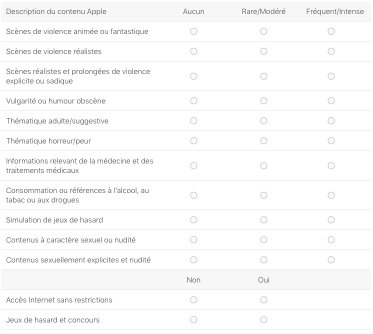

# Soumission Apple Appstore - iOS

Ce document liste toutes les informations nécessaires afin de soumettre rapidement une application iOS sur iTunesConnect pour:

* Une nouvelle application
* Une mise à jour d'application

## Nouvelle Application

### Informations de l'App Store - application

#### Informations traduisibles

* Nom
	* Nom de votre app tel qu’il apparaîtra dans l’App Store. 
	* Ce nom ne peut dépasser 50 caractères.
* Sous titre
	* Bref descriptif de votre app qui apparaîtra sous le nom de l’app dans l’App Store pour les utilisateurs dont les appareils sont dotés d’iOS 11 (ou toute version ultérieure).
	* Le sous titre ne peut dépasser 45 caractères.
* URL de l'Engagement de confidentialité
	* URL renvoyant vers l’Engagement de confidentialité de votre organisation. Les apps destinées aux enfants, celles offrant des abonnements avec renouvellement automatique ou des abonnements gratuits, mais aussi les apps exigeant une création de compte et celles ayant accès à un compte existant de l’utilisateur doivent obligatoirement disposer d’un Engagement de confidentialité, sous réserve des exigences légales supplémentaires. Un tel document est aussi recommandé pour les apps qui recueillent les données de l’utilisateur ou de l’appareil. 

#### Information Générales

* Langue principale
	* Si la traduction des informations d’une app n’est pas disponible pour un des territoires de l’App Store, les informations dans votre langue principale seront utilisées. 
* Catégorie principale (et secondaire optionellement)
	* Catégorie décrivant le mieux cette app. Pour plus d’informations, consultez les Définitions des catégories de l’App Store.
	* [Définitions des catégories de l’App Store](https://itunesconnect.apple.com/itc/static/category_definitions)

	
### Informations de l'App Store - tarifs et disponibilité

#### Calendrier tarifaire

* Prix
* Date de début
* Date de fin - par défaut durée illimitée

#### Disponibilité

* Par défaut: Disponible dans tous les territoires

## Nouvelle Application + mise à jour

### APP iOS

* Numéro de version
	* Numéro de version de l’app que vous ajoutez. La numérotation doit être conforme aux conventions de numérotation des logiciels.
	* Voir [Gestion sémantique de version](http://semver.org/lang/fr/)  

#### Informations spécifiques à la version - Informations traduisibles

* Aperçu et captures d’écran de l’app
	* Les captures d’écran doivent être au format JPG ou PNG et réalisées dans l’espace colorimétrique RVB. Les aperçus de l’app doivent être au format M4V, MP4 ou MOV, et ne doivent pas dépasser 500 Mo.
	* Merci de prendre en compte ce document officiel: [En savoir plus](https://developer.apple.com/library/ios/documentation/LanguagesUtilities/Conceptual/iTunesConnect_Guide/Appendices/Properties.html#//apple_ref/doc/uid/TP40011225-CH26-SW2) 

	* **Conseil**: Afin d'éviter les nombreuses captures d'écran à demander, Apple peut utiliser la plus grande résolution et les utiliser pour les résolutions inférieures. En d'autres mots, et pour un soucis de simplicité:
		* Ne donner que les captures d'écran:
			* Pour iPhone 6SPlus - 5,5 pouces - pour une application iPhone
				* 72 dpi
				* 1242 x 2208 pixels - portrait   
				* 2208 x 1242 pixels - paysage

			* Pour iPad Pro - 12,9 pouces - pour une application iPad
				* 72 dpi
				* 2048 x 2732 pixels - portrait   
				* 2732 x 2048 pixels - paysage

* Description
	* Une description de votre app, détaillant ses caractéristiques et ses fonctionnalités. Elle sera également utilisée pour votre app sur l’Apple Watch.

* Accroche
	* L’accroche vous permet d’attirer l’attention des visiteurs de votre page produit dans l’App Store sur les avantages actuels liés à votre app sans que vous n’ayez à soumettre une nouvelle version. Ce texte s’affichera au-dessus de votre description dans l’App Store pour les utilisateurs dont les appareils sont dotés d’iOS 11 (ou toute version ultérieure). 
	* 170 caractères

* Mots-clés
	* Un ou plusieurs mots-clés qui décrivent votre app. Les mots-clés rendent les résultats de recherche dans l’App Store plus précis. Séparez les mots-clés par une virgule.

* URL de l'assistance
	* URL avec des informations d’assistance pour votre app. Cette URL sera visible dans l’App Store. 

* URL marketing 
	* URL avec des informations commerciales concernant votre app. Cette URL sera visible dans l’App Store.
	

#### Informations générales sur l’app

* Icône de l’app
	* Cette icône sera utilisée dans l’App Store. Elle doit être au format JPG ou PNG, avec une résolution minimale de 72 ppp et doit être réalisée dans l’espace colorimétrique RVB. Elle ne doit comporter ni calques ni coins arrondis. 
* Classification
	* Pour chaque description de contenu, sélectionnez le niveau de fréquence qui décrit le mieux votre app. La classification de l’app qui sera affichée dans l’App Store est la même sur l’ensemble de vos plates-formes. Elle est basée sur la plate-forme ayant la classification la plus restrictive. Les apps ne doivent pas comprendre de contenu ou matériel (textes, graphiques, images, photographies, etc.) obscène, pornographique, offensant ou diffamatoire, ou tout autre contenu ou matériel qu’Apple peut raisonnablement juger contestable
	* [En savoir plus](https://itunesconnect.apple.com/WebObjects/iTunesConnect.woa/ra/ng/app_ratings)

	
	 
* Copyright
	* Nom de la personne ou entité qui détient les droits exclusifs de votre app, précédé de l’année durant laquelle les droits ont été obtenus (par exemple, « 2008 Acme Inc. »). N’indiquez pas une URL.
	 
* Coordonnées du représentant commercial
	* Prénom
	* Nom
	* Adresse
	* Ville
	* Etat
	* Code Postal / Zip Code
	* Pays
	* Numéro de téléphone
	* E-mail

* Afficher les coordonnées du représentant commercial dans l’App Store coréen. (case OUI/NON)

* Fichier de couverture géographique - Facultatif
	* Spécifiez les zones géographiques couvertes par votre app. Le fichier doit être au format .geojson et ne peut contenir qu’un seul élément multipolygone. 
	

#### Informations utiles à la vérification de l’app

* Informations de connexion
	* Veuillez fournir un nom d’utilisateur et un mot de passe. Ces informations nous seront nécessaires afin de nous connecter à votre app et de mener à bien le processus de vérification.
	* Informations que nous utiliserons afin de nous connecter à votre app et d’en vérifier toutes ses fonctionnalités. Si les utilisateurs accèdent à votre app par le biais d’un réseau social, vous devrez également nous communiquer les informations de connexion d’un compte à utiliser. Le nom d’utilisateur et le mot de passe doivent être valides et actifs pendant toute la durée du processus de vérification.

* Coordonnées
	* Personne de votre organisation à contacter si l’équipe de vérification des apps a des questions ou a besoin d’informations supplémentaires.
	* Nom, prénom, téléphone internationale et email
	
* Remarques
	* Informations complémentaires qui peuvent être utiles durant le processus de vérification de votre app. Incluez les renseignements nécessaires pour tester votre app, tels que ses paramètres spécifiques.
	* 4000 caractères

* Pièce jointe
	* Ajouter une pièce jointe si nécessaire, format zip si possible

#### Publication de la version

Une fois votre app approuvée, nous pouvons la publier directement pour vous. Si vous souhaitez la publier vous-même, vous pouvez soit spécifier une date soit la publier manuellement à tout moment, après son approbation. Lorsque votre app affiche l’état « Prêt à publier », vous pouvez distribuer des codes promotionnels, poursuivre les bêta-tests TestFlight, ou refuser la publication et soumettre une nouvelle build. Quel que soit votre choix, nous devons examiner votre app avant de la rendre disponible dans l’App Store. Lorsque votre app affiche l’état « En cours de traitement pour l’App Store », vous ne pouvez ni obtenir de nouveaux codes promotionnels, ni inviter de nouveaux testeurs, ni refuser votre app.

Veuillez choisir entre:

* Publier cette version manuellement
* Publier cette version automatiquement
* Publier automatiquement cette version après la vérification de l’app, mais pas avant le ...
	* Date à partir de laquelle votre app sera disponible dans l’App Store, en fonction de votre fuseau horaire. Si le processus de vérification de l’app n’est pas terminé à cette date, la version de votre app sera rendue disponible après son approbation. [Renseignez-vous sur les délais de vérification](https://developer.apple.com/support/app-store/). Si possible, nous affichons votre fuseau horaire actuel. Si le fuseau horaire change à la date choisie (par exemple, à cause de l’heure d’été), la différence entre les horaires de publication peut atteindre 3 heures. 
	
#### Publication graduelle des mises à jour automatiques

La publication graduelle des mises à jour automatiques vous permet de publier progressivement cette mise à jour au cours d’une période de sept jours auprès des utilisateurs ayant activé le téléchargement automatique des mises à jour. N’oubliez pas que cette version est également disponible dans l’App Store où tout utilisateur peut la télécharger manuellement. Vous pouvez interrompre la publication graduelle pendant une durée maximale de trente jours ou publier à tout moment cette mise à jour auprès de tous les utilisateurs. [Pour en savoir plus, cliquez içi](https://developer.apple.com/go/?id=itc-submission-process)

Veuillez choisir entre:

* Publier immédiatement la mise à jour auprès de tous les utilisateurs
* Publier la mise à jour au cours d’une période de 7 jours à l’aide de la publication graduelle

------

Dernière mise à jour du fichier: 10 Juin 2017